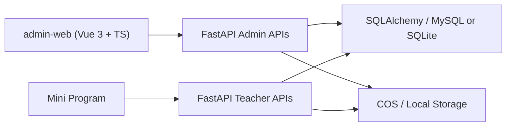

# 个人开发者控制台 Design

## 1. 方案结论

首期采用以下方案：

- 新增独立 Web 项目 `admin-web/`
- 复用现有 FastAPI 服务
- 新增 `admin` 访问依赖与管理向 API
- 不改现有小程序主链路
- 不引入新的身份系统或第二套数据库

这是当前成本最低、可维护性最高、对现有老师端影响最小的方案。

## 2. 备选方案对比

### 2.1 推荐方案：独立 `admin-web` + 复用 FastAPI

优点：

- 后台交互更适合桌面浏览器；
- 不污染老师端小程序结构；
- 易于扩展表格、筛选、图表和批量管理；
- 后续可以单独部署，也可以和现有服务一起静态托管。

代价：

- 需要新增一个前端工程；
- 需要补一批管理向 API。

### 2.2 复用现有 uni-app 做 H5 后台

优点：

- 技术栈统一；
- 可以复用部分请求工具。

缺点：

- 表格、筛选、信息密度和桌面交互体验受限；
- 代码语义会混淆老师端与后台端边界；
- 后续维护成本更高。

### 2.3 FastAPI 直接渲染后台页面

优点：

- 启动最快；
- 部署简单。

缺点：

- 界面上限低；
- 不适合复杂数据筛选和长期演进；
- 很难做出有质量的后台体验。

## 3. 架构设计



### 3.1 前端层

新增目录：

- `admin-web/`

职责：

- 提供后台登录态管理；
- 提供桌面端布局、导航和页面；
- 通过独立 API Client 调用管理向接口；
- 承载图表、筛选、表格和详情抽屉等交互。

### 3.2 后端层

沿用现有 `backend/app` 结构，在 `backend/app/api/` 下新增管理向路由文件，例如：

- `admin_console.py`

职责：

- 管理台访问鉴权；
- 提供后台聚合统计接口；
- 提供跨作者、跨用户、跨记录的管理查询；
- 保留服务端安全校验。

### 3.3 数据层

首期尽量复用现有表：

- `user`
- `question`
- `question_tag`
- `question_tag_rel`
- `paper`
- `paper_item`
- `ocr_record`
- `ocr_usage_log`

首期不强制新增表。若后续要补充审计日志、导出失败记录或后台操作记录，再引入新表。

## 4. 访问控制设计

## 4.1 推荐策略

首期不改 `User.role` 枚举，不加 `admin` 角色，而是新增配置白名单：

- `ADMIN_USER_IDS`
- `ADMIN_USERNAMES`

后端新增 `get_current_admin` 依赖：

1. 先复用当前 JWT 解析出登录用户；
2. 判断用户是否在后台白名单中；
3. 命中则放行，否则返回 403。

这样可以避免：

- 改动现有 `teacher/student` 角色逻辑；
- 触发首期数据库枚举迁移；
- 把“个人开发者后台”过早升级成通用权限系统。

## 4.2 安全边界

- 前端不缓存敏感系统配置；
- 后端返回的系统状态只返回脱敏字段；
- 管理 API 不允许绕过现有题目删除保护；
- 高风险操作必须前后端双重确认。

## 5. 管理台信息架构

### 5.1 一级导航

- 仪表盘
- 题库
- 标签
- OCR 记录
- 试卷
- 用户
- 成本监控
- 系统状态

### 5.2 页面职责

#### 仪表盘

展示：

- 题目总数
- 标签总数
- 试卷总数
- 用户总数
- 今日 OCR 调用数
- 最近 7 天 OCR 趋势
- 失败 OCR 次数
- 最近待处理风险提示

#### 题库

支持：

- 关键词、题型、难度、作者、是否校对筛选
- 列表分页
- 详情抽屉
- 编辑核心字段
- 删除

#### 标签

支持：

- 分类查看
- 新增
- 重命名
- 调整排序
- 安全删除

#### OCR 记录

支持：

- 按引擎、用户、日期、状态筛选
- 查看原图、识别结果、附图、置信度
- 查看人工修正记录
- 在后台直接修正识别结果

#### 试卷

支持：

- 查看列表
- 查看标题、作者、题量、导出状态
- 删除

首期不做复杂试卷编辑器。

#### 用户

支持：

- 只读查看用户基础信息
- 查看角色、学校、启用状态、注册时间
- 查看题目数、试卷数、OCR 使用量等基础归属统计

首期不做复杂封禁流、短信、找回密码等运营动作。

#### 成本监控

展示：

- OCR 日调用趋势
- 按引擎聚合
- 按用户聚合
- 失败率
- 高成本引擎占比

#### 系统状态

展示：

- `/health` 状态
- 当前数据库类型
- 当前存储模式（COS / local）
- 默认 OCR 引擎
- 关键开关摘要（如 Swagger 是否开启）

所有字段必须脱敏。

## 6. API 设计

## 6.1 认证与权限

- 复用 `POST /api/auth/login`
- 新增 `GET /api/admin/me`

用途：

- 前端登录后确认该账号是否具备后台访问权限；
- 返回后台必要的当前用户信息。

## 6.2 仪表盘

- `GET /api/admin/dashboard/summary`
- `GET /api/admin/dashboard/ocr-trend`
- `GET /api/admin/dashboard/recent-risks`

## 6.3 题库管理

- `GET /api/admin/questions`
- `GET /api/admin/questions/{question_id}`
- `PUT /api/admin/questions/{question_id}`
- `DELETE /api/admin/questions/{question_id}`

说明：

- 与老师端题库接口不同，管理端查询范围是全局，不再受“当前用户自己的题目或公开题目”限制。

## 6.4 标签管理

- `GET /api/admin/tags`
- `POST /api/admin/tags`
- `PUT /api/admin/tags/{tag_id}`
- `DELETE /api/admin/tags/{tag_id}`

## 6.5 OCR 记录管理

- `GET /api/admin/ocr-records`
- `GET /api/admin/ocr-records/{record_id}`
- `POST /api/admin/ocr-records/{record_id}/correct`

## 6.6 试卷与用户

- `GET /api/admin/papers`
- `DELETE /api/admin/papers/{paper_id}`
- `GET /api/admin/users`
- `GET /api/admin/users/{user_id}`

## 6.7 成本与系统

- `GET /api/admin/cost/ocr-usage`
- `GET /api/admin/system/status`

## 7. 前端工程设计

## 7.1 技术栈

- Vue 3
- TypeScript
- Vite
- Vue Router
- Pinia
- Element Plus
- ECharts

## 7.2 目录建议

```text
admin-web/
├── src/
│   ├── api/
│   ├── components/
│   ├── layouts/
│   ├── pages/
│   ├── router/
│   ├── stores/
│   ├── styles/
│   └── utils/
```

## 7.3 页面结构

- 顶层使用后台布局壳
- 左侧固定导航
- 顶部状态栏
- 主区为表格、图表、详情抽屉组合
- 高密度数据页优先使用筛选栏 + 表格 + 右侧详情面板

## 8. 界面设计方向

DESIGN SPECIFICATION
====================
1. Purpose Statement: 这是一个给个人开发者使用的管理后台，不是展示型官网。它需要优先保证信息密度、维护效率和异常可见性，同时比传统“土味后台”更克制、更有秩序感。
2. Aesthetic Direction: Industrial/utilitarian
3. Color Palette:
   - `#0F172A` 深石板蓝
   - `#F8FAFC` 冷白底色
   - `#CBD5E1` 边框灰
   - `#0F766E` 功能成功色
   - `#C2410C` 风险提醒色
   - `#B91C1C` 危险操作色
4. Typography:
   - `IBM Plex Sans`
   - `Noto Sans SC`
   - `JetBrains Mono`
5. Layout Strategy: 使用固定侧栏、顶部命令条和分层工作区；列表页采用不对称布局，左侧为筛选和主表格，右侧或弹层承接详情与编辑，避免传统单层满屏表格的压迫感。

### 8.1 设计参考抽象

将借鉴以下系统的“设计思想”，而不是照搬界面：

- `vue-vben-admin` 的布局骨架和工程组织
- `Soybean Admin` 的视觉克制与主题一致性
- `RuoYi-Vue-Plus` 的管理流设计与筛选模式
- `vue-element-admin` 的后台交互惯例

### 8.2 视觉原则

- 卡片数量少，强调信息块层次而不是堆满大号模块；
- 图表和数据表统一在深浅对比明确的容器中；
- 操作按钮收敛，危险操作只在明确上下文中出现；
- 首页优先显示风险和异常，不只是“总数看板”。

## 9. 数据与服务改造点

### 9.1 必要新增

- 新增后台白名单配置；
- 新增 `get_current_admin` 依赖；
- 新增管理向查询接口；
- 新增聚合统计查询；
- 新增脱敏系统状态接口。

### 9.2 暂缓改造

- 新的审计日志表；
- 导出任务统一任务化；
- 完整操作历史；
- 多管理员协作能力。

## 10. 测试策略

### 10.1 后端

- 为后台权限依赖补单测；
- 为后台聚合统计接口补接口测试；
- 为全局题库/OCR/用户查询接口补筛选与权限测试；
- 为危险删除接口补引用保护回归测试。

### 10.2 前端

- 至少保证 `admin-web` 可构建；
- 为筛选参数映射、状态格式化等纯函数补轻量测试；
- 关键页面手工验证：登录、仪表盘、题目编辑、标签删除保护、OCR 详情查看。

## 11. 风险与缓解

### 11.1 现有用户角色没有 admin

缓解：

- 使用配置白名单作为首期后台准入机制。

### 11.2 当前没有系统错误日志表

缓解：

- 首期系统状态页只做健康状态和配置摘要；
- “最近风险”优先基于 `ocr_usage_log`、题目数据量和接口可达性实现；
- 导出失败等更深层监控放到后续任务化阶段。

### 11.3 老师端接口作用域过窄

缓解：

- 不强行复用老师端列表接口；
- 为后台补专门的全局查询接口。

