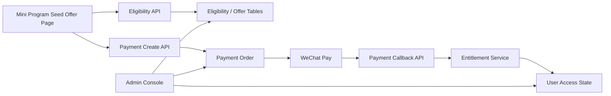

# 种子用户定价与支付 Design

## 1. 方案结论

首期采用以下方案：

- 使用“资格锁定”而不是“注册先后”作为种子活动名额口径
- 将免费发放、付费订单和最终权益拆成独立对象
- 首期前端只要求微信小程序内微信支付可用
- 支付渠道层预留支付宝，但不要求本阶段完成支付宝前端入口
- 后台需能查看、纠正和追踪资格、订单与权益状态

这是当前最稳的方案，因为它能同时满足：

- 活动规则简单透明；
- 名额不会被无效注册粗暴吃掉；
- 支付接入与权益发放边界清晰；
- 后续扩展正式套餐时不需要推翻重来。

## 2. 备选方案对比

### 2.1 推荐方案：资格锁定驱动

规则：

- 用户点击“领取资格”时才参与名额判定；
- 前 10 个锁到免费资格；
- 第 11-50 个锁到 9.9 资格；
- 9.9 资格在支付有效期内暂时占位；
- 超时未支付则释放。

优点：

- 最符合用户对“前 N 名”的理解；
- 不会因为路过注册而浪费名额；
- 便于控制超卖、超时释放、人工纠错和统计。

代价：

- 需要新增资格状态模型；
- 需要明确支付超时与释放任务。

### 2.2 按注册顺序直接发资格

规则：

- 用户一注册就按照用户创建顺序分配免费或 9.9 身份。

优点：

- 实现最简单；
- 不需要单独的领取动作。

缺点：

- 很容易被无效注册吃掉名额；
- 后续往往会出现人工回收名额诉求，规则会变脏；
- 很难和真实支付行为自然对齐。

### 2.3 后台人工白名单发资格

规则：

- 不做自动名额判断，由个人开发者在后台人工指定谁免费、谁 9.9。

优点：

- 完全可控；
- 早期试验成本低。

缺点：

- 不是真正的产品化活动机制；
- 会把大量运营动作变成手工处理；
- 无法顺滑过渡到自动支付体系。

## 3. 架构设计

### 3.1 活动层

首期建议引入活动对象，例如：

- `seed_2026_round_1`

职责：

- 定义当前活动是否开启；
- 定义免费名额数、9.9 名额数和支付有效期；
- 为未来多轮活动保留空间。

即使首期只开一轮，也建议保留活动概念，避免未来修改规则时把逻辑写死在代码里。

### 3.2 资格层

资格层负责回答一个问题：

- 这个用户是否已经拿到本轮种子资格？拿到的是哪一种？

建议资格类型：

- `free_seed`
- `paid_seed_9_9`

建议资格状态：

- `locked`
- `expired`
- `converted`
- `cancelled`

说明：

- `locked`：资格已抢到，尚未完成后续流程；
- `expired`：限时支付资格超时失效；
- `converted`：已转成最终权益；
- `cancelled`：被后台人工取消。

免费资格可以在发完权益后立即转为 `converted`。

### 3.3 订单层

订单层负责回答：

- 用户是否真的付了钱？

建议订单类型：

- `seed_paid_lifetime`

建议订单状态：

- `pending`
- `paid`
- `closed`
- `expired`
- `refunded`

建议渠道枚举：

- `wechat_miniapp`
- `alipay`
- `manual`

首期真正启用的是：

- `wechat_miniapp`
- `manual`

其中 `manual` 用于后台补单、赠送或异常纠错。

### 3.4 权益层

权益层负责回答：

- 用户现在是否真的有终身使用权？

首期建议只做一种核心权益：

- `lifetime_access`

建议状态：

- `active`
- `revoked`

建议来源：

- `seed_free`
- `seed_paid`
- `manual_grant`

这层必须保持简单。首期不要引入月卡、年卡、次数包等复杂类型。

## 4. 核心流程设计

## 4.1 领取资格流程

1. 用户登录后进入种子计划页。
2. 用户点击“领取资格”。
3. 服务端在事务中检查：
   - 用户是否已有当前活动资格；
   - 当前免费资格是否还有余量；
   - 当前 9.9 资格是否还有余量。
4. 服务端分配结果：
   - 若免费有余量，创建 `free_seed` 资格；
   - 否则若 9.9 有余量，创建 `paid_seed_9_9` 资格；
   - 否则返回活动结束。
5. 免费资格直接进入权益发放流程。
6. 9.9 资格返回支付参数与支付有效期。

关键点：

- 必须使用数据库事务保证并发安全；
- 名额统计必须基于真实资格记录，而不是前端缓存数字。

## 4.2 免费资格发放流程

1. 创建免费资格记录。
2. 生成一条 0 元“发放记录”或人工订单记录。
3. 直接调用权益发放服务。
4. 将资格状态更新为 `converted`。

这样可以让免费和付费最终都落到统一的权益服务里，不会形成两套口径。

## 4.3 9.9 支付流程

1. 创建 `pending` 订单。
2. 锁定对应 `paid_seed_9_9` 资格。
3. 返回微信小程序支付所需参数。
4. 用户支付成功后，微信回调通知后端。
5. 后端校验订单、渠道、金额与幂等状态。
6. 调用权益发放服务。
7. 将订单改为 `paid`，资格改为 `converted`。

## 4.4 超时释放流程

对于 9.9 资格，建议配置支付有效期，例如：

- `30 分钟`

处理逻辑：

1. 资格在 `locked` 且订单 `pending` 状态下占用名额。
2. 到达超时时间后：
   - 若订单仍未支付，则订单改为 `expired` 或 `closed`；
   - 资格改为 `expired`；
   - 名额回到可用池。

触发方式可以是：

- 定时任务扫描；
- 支付前二次校验；
- 后台补偿任务。

首期建议先用定时扫描或在用户重试时补偿校验，不必一开始做复杂任务系统。

## 4.5 幂等与补偿

支付最容易出错的地方不是下单，而是回调和补偿。

必须保证：

- 同一个渠道交易号重复回调不会重复发权益；
- 订单已 `paid` 时再次回调只返回成功确认；
- 权益已存在时再次发放不会重复插入冲突记录；
- 手工补单与自动回调遵循同一套权益服务逻辑。

## 5. 支付渠道设计

### 5.1 首期渠道结论

首期正式支付只要求：

- 微信小程序内微信支付

原因：

- 当前产品入口就是微信小程序；
- 用户路径最短；
- 不需要额外建设第二个客户端。

### 5.2 支付宝定位

支付宝在首期的定位是：

- 渠道抽象预留
- 后端模型预留
- 暂不开放客户端购买入口

后续如果要支持支付宝，可以有三条路：

- 支付宝小程序
- H5 支付页
- 独立 App 支付

当前 spec 不要求现在就决定是哪一条，只要求不要把模型写死成只能支持微信。

## 6. 后台与运营设计

后台至少应能查看以下信息：

- 当前活动是否开启
- 免费资格总数、已发放数、剩余数
- 9.9 资格总数、已锁定数、已支付数、已释放数
- 用户资格列表
- 订单状态列表
- 权益发放列表
- 人工补单与人工赠送记录

后台至少应支持以下动作：

- 手动关闭异常 `pending` 订单
- 手动释放异常占位资格
- 手动赠送终身权益
- 手动补记一条线下或人工支付记录
- 查看支付回调失败或异常原因

首期不要求复杂财务报表，但必须做到：

- 能解释每一个名额去了哪里；
- 能解释某个用户为什么有或没有终身权益。

## 7. API 设计建议

建议新增以下方向的接口：

- `GET /api/billing/seed-offer`
- `POST /api/billing/seed-offer/claim`
- `POST /api/billing/orders`
- `GET /api/billing/orders/{order_id}`
- `POST /api/billing/payments/wechat/notify`
- `GET /api/billing/me/entitlements`

后台向接口建议预留：

- `GET /api/admin/billing/seed-summary`
- `GET /api/admin/billing/eligibilities`
- `GET /api/admin/billing/orders`
- `GET /api/admin/billing/entitlements`
- `POST /api/admin/billing/orders/{order_id}/close`
- `POST /api/admin/billing/eligibilities/{eligibility_id}/release`
- `POST /api/admin/billing/entitlements/grant`

## 8. 数据改造建议

### 8.1 必要新增

建议新增的核心表或等价模型：

- `billing_offer`
- `billing_eligibility`
- `billing_order`
- `billing_entitlement`
- `billing_event_log`

其中：

- `billing_event_log` 用于记录领取、支付、释放、发放、手动操作等关键事件；
- 它可以很轻量，但首期最好就有，后面排查会省很多事。

### 8.2 可延后

以下内容可以等首期付费跑通后再做：

- 退款自动化
- 正式发票或财务系统
- 包月包年套餐
- 邀请奖励
- 多轮营销活动编排器

## 9. 风险与缓解

### 9.1 超卖风险

缓解：

- 用事务和唯一约束保证资格分配原子性；
- 不用纯前端计数做名额判断。

### 9.2 无效注册占坑

缓解：

- 采用“点击领取资格”而不是“注册即占位”。

### 9.3 支付成功但权益未发

缓解：

- 回调逻辑与权益发放服务幂等；
- 增加事件日志和后台手动补发能力。

### 9.4 活动规则后续调整

缓解：

- 用 `offer` 配置化免费名额、付费名额和支付有效期；
- 不把“10”和“50”硬编码在多个业务分支里。

### 9.5 过早接入多渠道

缓解：

- 首期只在微信小程序内落微信支付；
- 支付宝只保留通道抽象，等真实入口明确后再开。

## 10. 测试策略

### 10.1 后端

- 为资格分配补并发与重复领取测试；
- 为免费资格直接开通补测试；
- 为 9.9 订单创建、支付成功、回调重试补测试；
- 为超时释放补测试；
- 为后台人工关闭、人工发放补测试。

### 10.2 前端

- 种子计划页至少覆盖三种状态：
  - 免费资格；
  - 9.9 支付资格；
  - 活动结束。
- 支付发起成功、取消、失败提示需手工验证；
- 已开通终身权益用户不应再次看到领取或支付主按钮。
